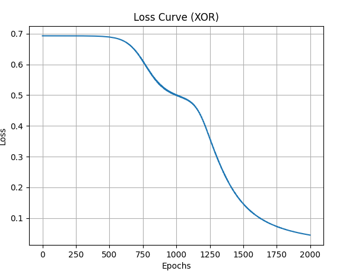
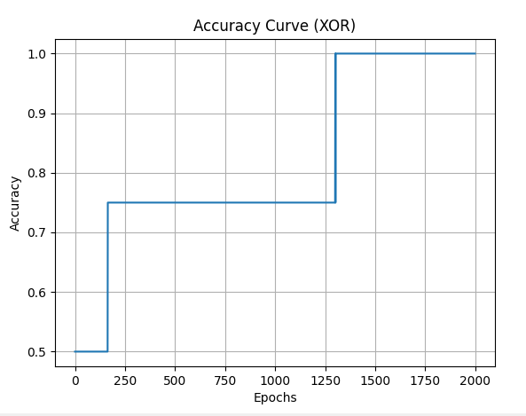
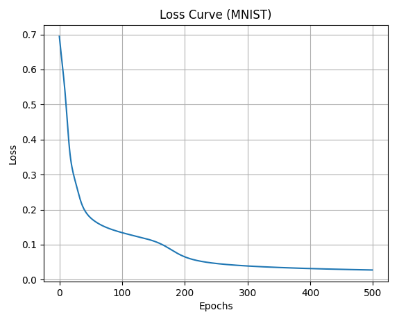
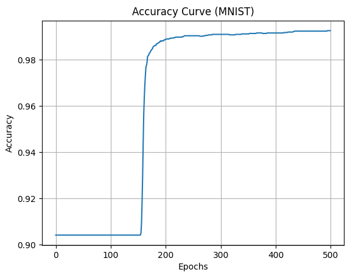

# Neural-Network-from-scratch-using-numpy
A fully functional implementation of a 2-layer neural network built from first principles, including forward propagation, backpropagation, gradient descent, and training on both XOR and MNIST datasets with performance visualization.

## Features
- 2-layer neural network
- ReLU & Sigmoid activations
- Binary Cross Entropy loss
- Gradient Descent optimization
- Accuracy tracking
- Loss & Accuracy visualization
- MNIST dataset support

## Results

### XOR Dataset
- Accuracy: ~100%
- Loss converges smoothly

### MNIST (Binary: 0 vs Not 0)
- Accuracy: ~85–90% (subset)
- Demonstrates real dataset learning

### XOR Training



### MNIST Training



## Project Structure
nn/ → core neural network
data/ → datasets
train_xor.py
train_mnist.py

## How to Run

```bash
pip install -r requirements.txt
python train_xor.py
python train_mnist.py
```

## What I Learned
- Forward propagation

- Backpropagation (chain rule)

- Gradient descent

- Numerical stability

- Working with real datasets


## Future Improvements
- Deep neural networks (multi-layer)

- Adam optimizer

- Mini-batch training

- Multi-class classification (Softmax)


